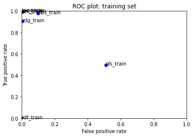
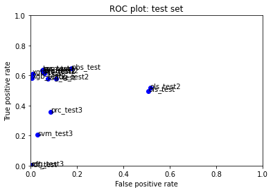
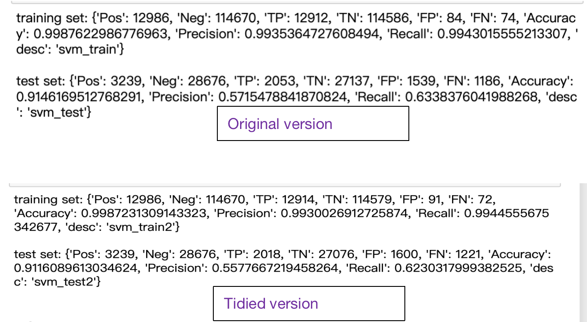
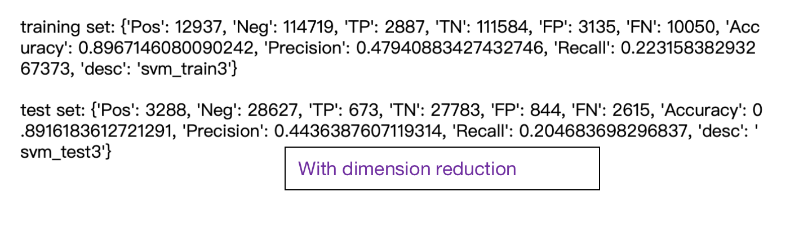
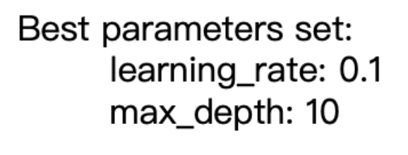

# Final Assignment 01


### Task

Your work will be assessed on:

. how accurately your model classifies on a test set
. how well your model generalizes 
. the organization and documentation of your Jupyter Notebooks
. communication of your work in class reflections and final presentations
. model improvement over the semester
. -10 points if you use a random_seed of 74 in your train/test data split

### Solution

In my work, I finally choose a famous machine learning model:Xgboost, as my final model. Also, I tried some efforts to improve the results. Finally, I get 0.97 accuracy, 0.98 precision and 0.69 recall on training dataset and 0.95 accuracy, 0.91 precision and 0.61 recall on test dataset.

```python
training set: {'Pos': 12986, 'Neg': 114670, 'TP': 8914, 'TN': 114468, 'FP': 202, 'FN': 4072, 'Accuracy': 0.9665193958764179, 'Precision': 0.9778411584028083, 'Recall': 0.6864315416602494, 'desc': 'xgb_train'} 

test set: {'Pos': 3239, 'Neg': 28676, 'TP': 1985, 'TN': 28479, 'FP': 197, 'FN': 1254, 'Accuracy': 0.954535484881717, 'Precision': 0.9097158570119157, 'Recall': 0.6128434702068539, 'desc': 'xgb_test'}
```

To improve the result, I tried several methods. I tidy the dataset first, which convert all case to lower-case, remove words with high frequency(common words) and remove punctuation. Also, since the dimension is too high and the running speed is too time-consuming, I attemped to use dimension reduction method to make the features fewer. But due to the unique feature of toxic comment data, these methods almost failed.

The ROC graph of training set(the closest the upper-left corner, the best performance):



The ROC graph of test set(the closest the upper-left corner, the best performance):




### Improvement

As reading some news about machine learning before, I noticed a model named "Xgboost" appears several times and seems it has good performance. I tried and found it can be used the same way as sklearn, so I tried to code the model and finally achieves better performance than other models.

```python
xgb = XGBClassifier()
xgb.fit(X_train, y_train)

xgb_performance_train = BinaryClassificationPerformance(xgb.predict(X_train), y_train, 'xgb_train')
xgb_performance_train.compute_measures()
print("training set:",xgb_performance_train.performance_measures, "\n")
```

### Modification 

To improve the result, I tidyed the dataset by low-casing and remove some common words and punctuation. But the results of almost models show little negative influence. For example, in original version, the performance of SVM is 0.91 accuracy, 0.57 precision and 0.63 recall on test set, but 0.91 accuracy, 
0.55 precision, 0.62 recall in tidied version.




```python
# lowcasing
toxic_data.comment_text = toxic_data.comment_text.apply(lambda x: " ".join(x.lower() for x in x.split()))
print("lowcasing complete")

# remove punctuaton
toxic_data.comment_text = toxic_data.comment_text.str.replace("[^\w\s]", "")
print("punctuation removal complete")

# remove common words
word_freq = list(pd.Series(" ".join(toxic_data.comment_text).split()).value_counts()[:20].index)
toxic_data.comment_text = toxic_data.comment_text.apply(lambda x: " ".join(x for x in x.split() if x not in word_freq))
print("common words removal complete")
```

Also, since the number of features is too large, I attemped to use dimension reduction. But the results show dimension reduction can lead a large negative effect. The performance of SVM becomes: 0.89 accuracy, 0.44 precision, 0.2 recall in this version.




```python
svd = decomposition.TruncatedSVD(512)
X = svd.fit_transform(X)
```


To make a better performance, I use sklearn to tune the parameters of xgboost by cross-validation. After carefully search, I get these parameters: learning_rate: 0.1, max_depth: 10, and lead to a better performance.



Also, in the stage of model assessment, I use f1-score which combine precision and recall to assess models. As what I expected, Xgboost achieved the best score.

| model | f1 score |
| :---- | :---- |
| ols_test | 0.16611740473738415 |
| svm_test | 0.6010832967354707 |
| lgs_test | 0.6045016077170418 |
| nbs_test | 0.40424096385542163 |
| prc_test | 0.6080781180648025|
| rdg_test | 0.5201444845790497|
| rdf_test | nan |
| ols_test2 | 0.1705237515225335 |
| svm_test2 | 0.588595595741578 |
| lgs_test2 | 0.5783760312635693 |
| prc_test2 | 0.5876860227604319 |
| rdg_test2 | 0.4543478260869565 |
| svm_test3 | 0.28012486992715924 |
| rdg_test3 | 0.00479472580161822 |
| prc_test3 | 0.3397094779231986 |
| xgb_test | 0.7323372071573511 |
|xgb_test2 | 0.7126739375705152|
