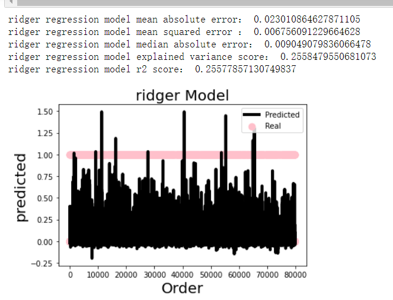
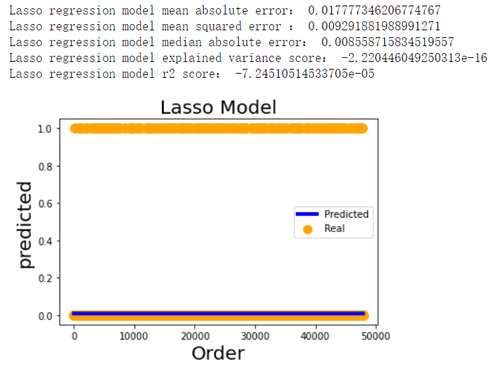
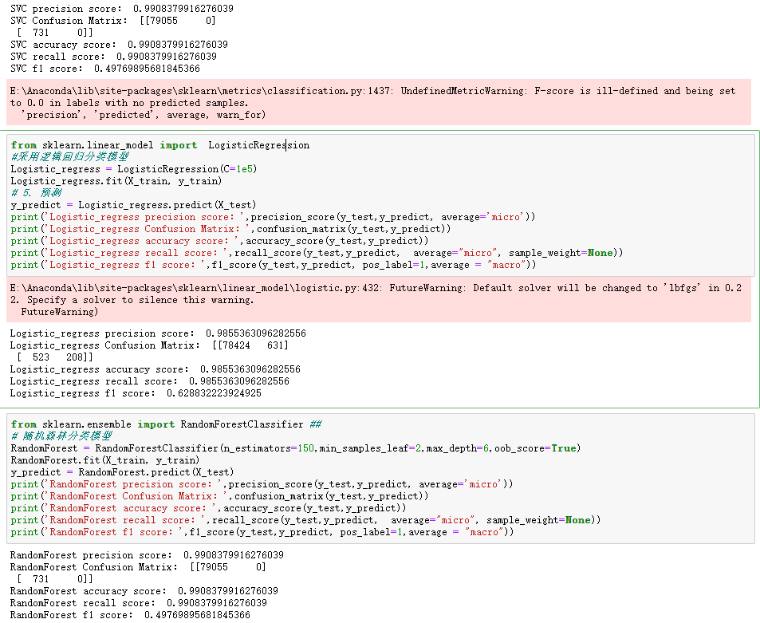
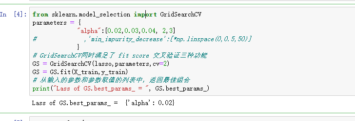
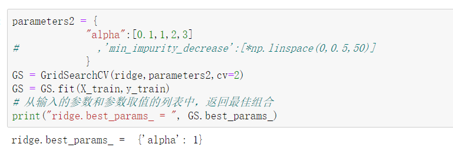
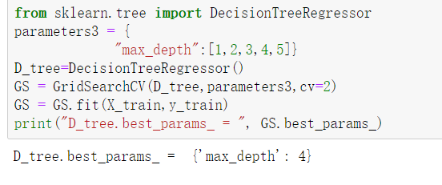
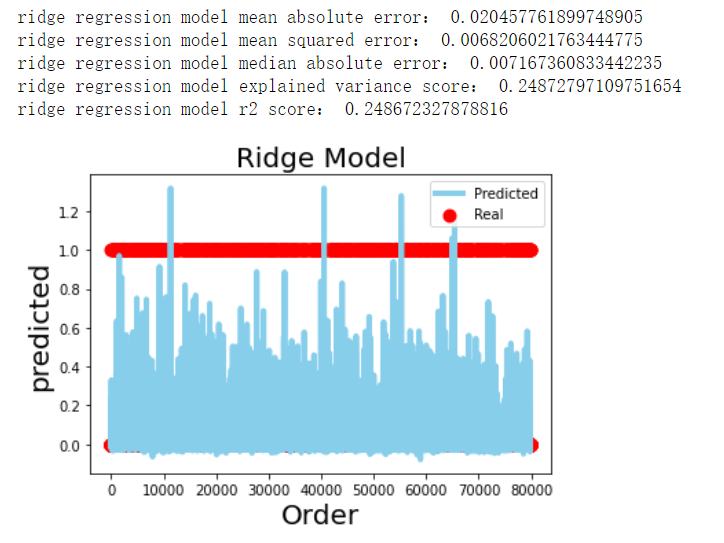
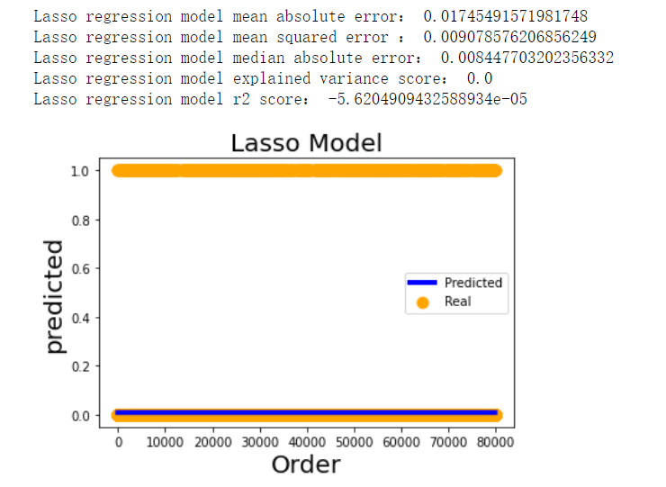
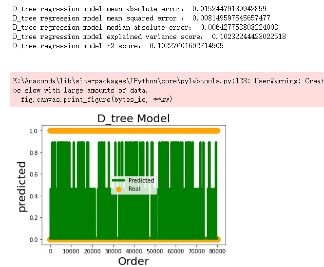

Final Assignment 01 {.c22}
-------------------

#### Task {#h.gjdgxs .c5}

Your work will be assessed on:

1.  how accurately your model classifies on a test set
2.  how well your model generalizes
3.  the organization and documentation of your Jupyter Notebooks
4.  communication of your work in class reflections and final
    presentations
5.  model improvement over the semester
6.  -10 points if you use a random\_seed of 74 in your train/test data
    split

#### Solution {.c5}

I used many of model including DecisionTreeRegressor，ridge
regression， lasso regression， Linear
Regression，XGBRegression，SVC，Logistic\_regress， RandomForestClassifier
to confirm which one of them could be better optimal。,I found that
lasso model's mean\_squared\_error performance was pretty well with
 0.017777346206774767，Ridge model's mean absolute error was
distinguished with 0.009291881988991271.

 

#### Improvement {.c5}

Then, I decide to take the classified model  in order to figure out if
the classified model can better fit the model and get the optimal result
after the process of fitting and predicting. After doing research from
the website google as well as baidu, I intend to utilize the classified
model pertaining SVC, Logistic\_regress ，RandomForest  in copying with
fitting the original data as well as  predicting classified result ,and,
I maked use of the criteria of precision score, accuracy score, recall
score, f1 score so as to check the models’ efficiency .And ,from
 observing the final result , I noticed that Logistic regression model
got the higher  precision score with 0.9855363096282556 , higher
accuracy score with 0.9855363096282556 , higher recall score：
 0.9855363096282556 , the results is as follows:

Nonetheless, this kind of result cannot be better than it of
regressions, thus I returned to seize the regression model for better
excavating the total data.

#### Modification {.c5}

To select the best alpha value of ridge and lasso regression model, I
found the API GridSearchCV would be the most suitable tool on progress
of deciding the most optimal parameters. What’s more, I set a series of
parameters of the lasso model including [0.02,0.03,0.04, 2,3], and the
best parameter is 0.02 .

I set a series of parameters of ridge regression model
including [0.1,1,2,3], and the best parameter is 1 .

I set a series of parameters of the DecisionTree model
including “max\_depth:[1,2,3,4,5],” and the best parameter is 4 .

Then I took the optimal parameters of those regressions to explore the
regression analysis , the final results ares as follows:

* * * * *

 

